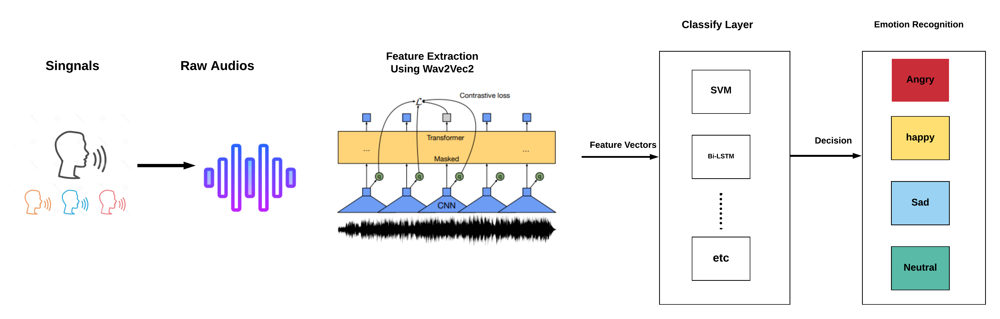
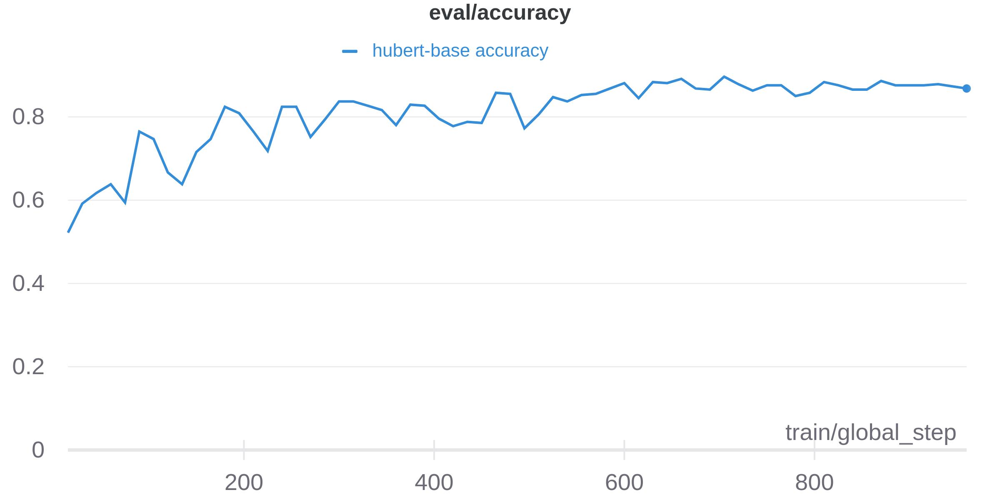
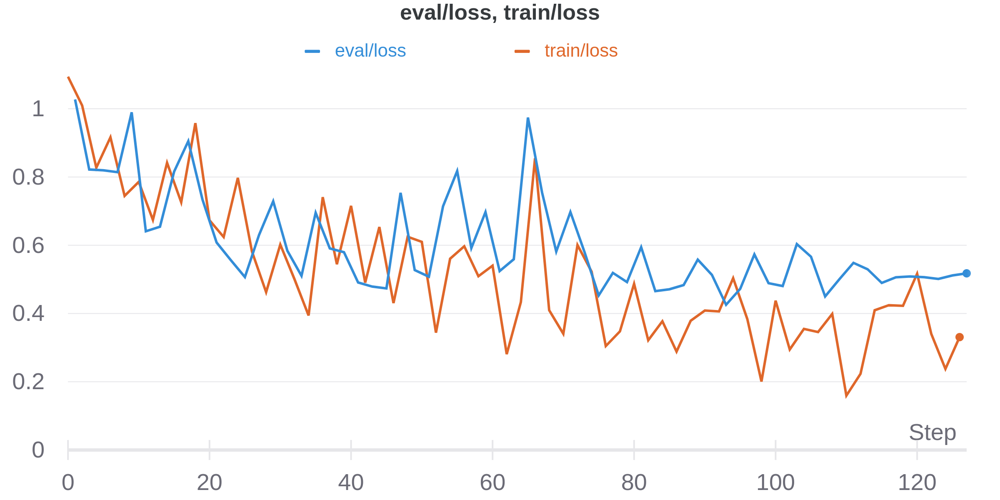
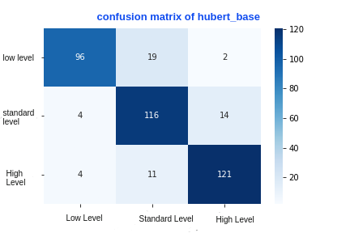
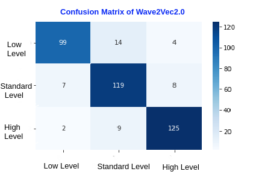
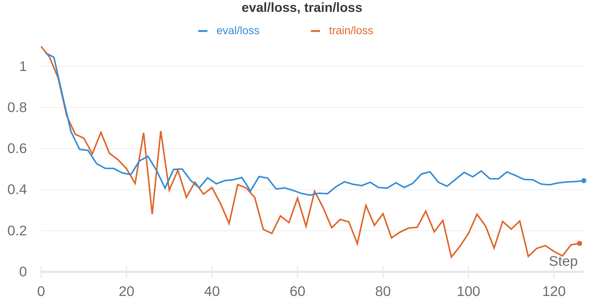

# Implementaion of  Arabic Speech Emotion Recognition Employing Wav2vec2.0 and HuBERT Based on BAVED Dataset
## Architecuture Model

<!-- ### Hubert-base

 -->

<!-- ### Wav2vec2

 -->

## Datasets:
name| Language| Access | Descreption
-------- | -------- |--------|--------|
[Basic Arabic Vocal Emotions Dataset](https://www.kaggle.com/a13x10/basic-arabic-vocal-emotions-dataset) | Arabic | Free ✔️|Basic Arabic Vocal Emotions Dataset (BAVED) is a datasetthat contains an arabic words spelled in diffrent levels of emotions recorded in an audio/wav format. The records contain 3 level of labeling ,  Level 0 is when the speaker is expressing a low level of emotion, this is similar to feeling tired or feeling down. Level 1 is the the standered level, it is the way the speaker speaks daily where he/she is expressing a neutral emotions,finally the level 2 emotion, its when the speaker is expressing a high level of positive or negative emotions (happiness, joy, sadness, anger, etc…).
[Arabic Natural Audio Dataset](https://www.kaggle.com/suso172/arabic-natural-audio-dataset) | Arabic | Free ✔️|Eight videos of live calls between an anchor and a human outside the studio were downloaded from online Arabic talk shows. Each video was then divided into turns: callers and receivers. To label each video, 18 listeners were asked to listen to each video and select whether they perceive a happy, angry or surprised emotion. Silence, laughs and noisy chunks were removed. Every chunk was then automatically divided into 1 sec speech units forming our final corpus composed of 1384 records.
[EYASE](https://drive.google.com/file/d/1dGEhcc3hjtZKMkojdLxdSGYo2Nk4UJxF/view?usp=sharing) | Arabic | Free ✔️ | 
[KSUEmotions](https://catalog.ldc.upenn.edu/LDC2017S12) |Arabic | Paid | KSUEmotions was developed by King Saud University (KSU) and contains approximately five hours of emotional Modern Standard Arabic (MSA) speech from 23 subjects. Speakers were from three countries: Yemen, Saudi Arabia and Syria.

## Models

Dataset | Model/Archit | Length(min) | No of records  | Accuracy |Ckpt|ToDo
-------- | -------- |--------|--------|--------|-------- | --------
EYSAE | [Elgeish](https://huggingface.co/elgeish/wav2vec2-large-xlsr-53-arabic) / wav2vec2 | 19 min | 499 | 64 | | ✔️
EYSAE | [othrif](https://huggingface.co/othrif/wav2vec2-large-xlsr-arabic)  / wav2vec2 | 19 min | 499 | 67 | |✔️
EYSAE | [Zaid](https://huggingface.co/Zaid/wav2vec2-large-xlsr-53-arabic-egyptian) / Wave2vec2 | 19 min | 499 | 67 || ✔️
EYSAE | hubert-base | 19 min | 499 | 70 || ✔️
EYSAE | hubert-large | 19 min | 499 | 64 || ✔️
BAVED | Elgeish | 53 min | 1935 | 89 | [ckpt](https://wandb.ai/gof/huggingface/runs/17eh53w1?workspace=user-omarmohamed88)|✔️
BAVED | hubert-base | 53 min | 1935 | 87||✔️
BAVED + EYSAE | Elgeish |  7 2min |2434|84 |  | ✔️

